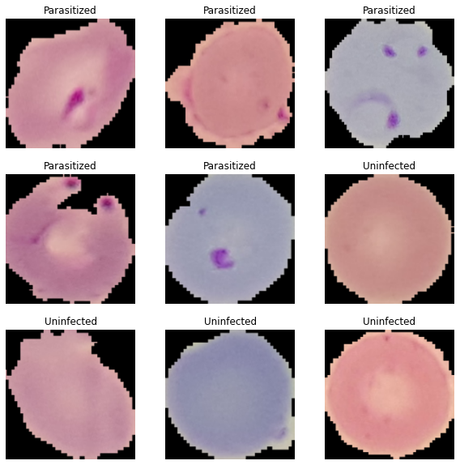
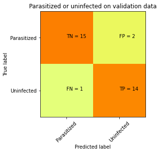

# Image Classification on malaria detecteion using cell images 
# The classifier for trying out is available here : https://malaria-detection-cells.herokuapp.com/
This is a very simple web app which classifies whether the cells are parasitized(infected) or uninfected.
The dataset is avaliable on kaggle competitions : malaria-cell-images

The sample images for malaria cells :

The confusion matrix which is calculated on the validation set is :

# The notebook for this is available here : https://www.kaggle.com/pra1210/image-classification3
